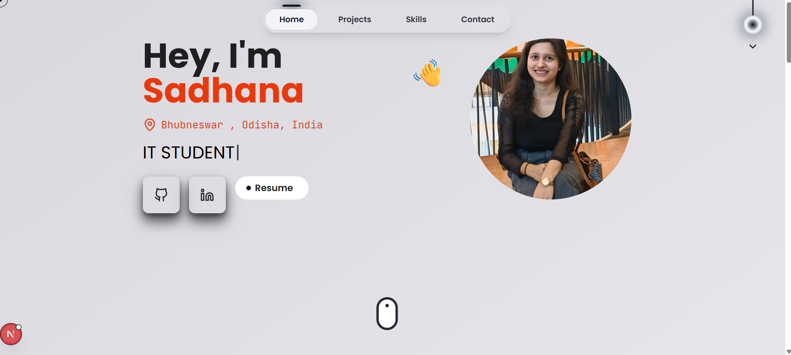

# 🚀 Sadhana Dash — Developer Portfolio

Welcome to my first ever portfolio website:  
🌐 **Live Demo : [sadhanadash.vercel.app](https://my-first-portfolio-rust-two.vercel.app)**  
This site showcases who I am — developer, creator, and builder — in the simplest yet most impactful way.



---

## 📌 About Me

Hey, I'm *Sadhana Dash, currently pursuing **B.Tech in Computer Science and Engineering* at *Raajdhani Engineering College*.  
I'm a passionate *Full Stack Developer* who loves building dynamic, responsive, and user-friendly web applications. I enjoy exploring modern technologies, learning new frameworks, and solving real-world problems through code.  

My current tech stack revolves around the *MERN (MongoDB, Express, React, Node.js)* ecosystem, and I’m also skilled in *Next.js, **Tailwind CSS, and **TypeScript*.  
I aim to craft beautiful, functional, and performance-oriented digital experiences that make a difference.

---

💡 “Code is not just logic, it’s creativity in motion.”
---

## 🛠️ Tech Stack

- **Framework:** Next.js 15 (App Router)
- **Language:** TypeScript
- **Styling:** Tailwind CSS + Custom Theme Tokens
- **Icons:** Lucide, React Icons
- **Forms & Mail:** EmailJS
- **Deployment:** Vercel
- **Animations:** Framer Motion
- **Design:** Mobile-first, fully responsive, dark/light mode

---

## ✨ Key Features

- 🌓 **Dark / Light Mode** (auto-detect + theme tokens)
- ⚡ Smooth scroll-to-section navigation
- 🧠 **Minimalist Design** with clean layout and shadows
- ✨ **Animated Navigation** with Framer Motion
- 📩 Working **Contact Form** via EmailJS + toast feedback
- 💼 Projects modal with rich details and hover effects

---

## 🧪 Running Locally

```bash
git clone https://github.com/sadhanazy/my-portfolio.git
cd portfolio
npm install
npm run dev
````

> Make sure to add the following environment variables in a `.env.local` file if you're using EmailJS:

```env
NEXT_PUBLIC_EMAILJS_SERVICE_ID=your_service_id
NEXT_PUBLIC_EMAILJS_TEMPLATE_ID=your_template_id
NEXT_PUBLIC_EMAILJS_PUBLIC_KEY=your_public_key
```

---

## 📬 Contact Me

If you like my work, let’s get in touch:

* 📩 Email: [sadhanadash2005@gmail.com](mailto:sadhanadash2005@gmail.com)
* 🔗 [LinkedIn](https://www.linkedin.com/in/sadhana-dash-2a5368351/)
* 💻 [GitHub](https://github.com/Sadhanazy)


---

## 📄 License

This project is open source and free to use. Feel free to fork and build on top of it, just give credit where due.

---

### 💡 Bonus Tip

Want to use this portfolio as a base? Go for it. Clone it, customize it, and make it yours.

---

> Built with passion, pixels, and a little bit of discipline.

---
